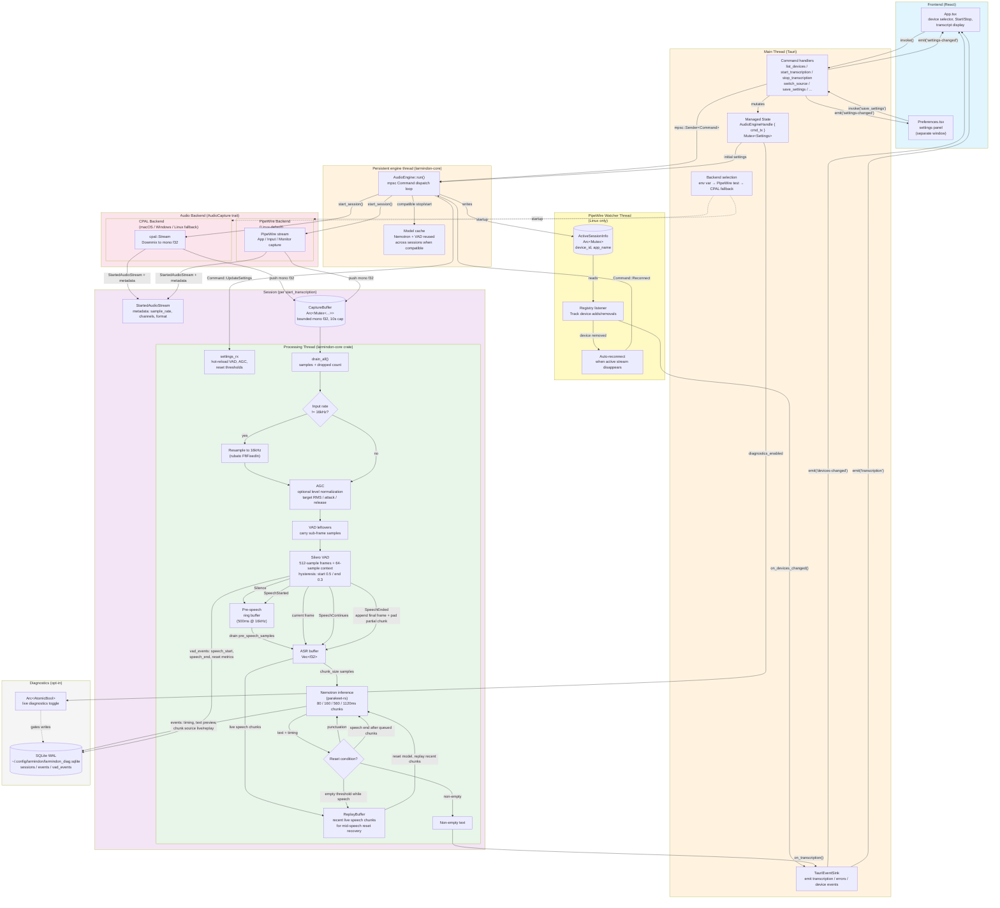

# Larmindon

A real-time captioning desktop app built with Tauri, React, and [parakeet-rs](https://github.com/altunenes/parakeet-rs) (NVIDIA Nemotron streaming ASR).

> **Warning:** This project is early-stage and under active development. Expect rough edges.


## How it works

Larmindon captures audio from an input device, resamples it to 16kHz, and feeds it to the Nemotron streaming speech recognition model. Transcribed text appears in real time in a scrolling text area.

The audio pipeline runs on a dedicated OS thread, communicating with the Tauri frontend via channels and events. Audio capture is abstracted behind an `AudioCapture` trait; CPAL is used on macOS/Windows, and PipeWire is the default on Linux (with CPAL as a fallback).

### Architecture



#### Key data flows

- **Commands** flow down: React `invoke()` → Tauri command handler → `mpsc` channel → Engine thread
- **Events** flow up: Processing thread → `app_handle.emit()` → React event listener
- **Audio** flows through `CaptureBuffer`: audio backend callback pushes bounded mono f32 samples, processing thread drains all available samples and tracks drops
- **Backend selection** at startup: `LARMINDON_AUDIO_BACKEND` env var → test PipeWire availability → fall back to CPAL. Only one backend is active per session.
- **Device monitoring** (Linux/PipeWire only): a watcher thread monitors the PipeWire registry for device adds/removals, emits `devices-changed` events to the frontend, and sends `Command::Reconnect` to the engine if the active device disappears
- **Shared session state**: the engine writes `ActiveSessionInfo` (device ID, app name, device type) to shared state; the watcher reads it to detect when the active device is lost
- **Settings hot-reload** uses `Command::UpdateSettings` to update VAD thresholds, AGC parameters, diagnostics toggling, punctuation reset, and empty-reset threshold without restarting the session
- **Decoder resets** happen at three points: speech end after queued chunks are consumed, sentence punctuation (`. ? !`), or the stuck-state heuristic (configurable, default 6 consecutive empty chunks). Mid-speech reset replays recent live speech chunks after resetting the model.
- **All threads are OS threads** — no async runtime (tokio, etc.)

#### Interactive visualization

An animated browser-based visualization of the pipeline is available in [`visualization/`](visualization/index.html) — open `visualization/index.html` in any browser (no build step). It simulates audio data flowing through capture, resampling, AGC, VAD, pre-speech buffering, ASR chunking, replay recovery, diagnostics, and Nemotron inference stages with configurable scenarios (normal speech, silence, intermittent, stuck decoder).

## Prerequisites

- **Nemotron streaming model files** downloaded locally (set the model path via Preferences: Cmd/Ctrl+, or the ⚙️ button)
- Node.js and npm
- Rust toolchain
- Tauri v2 prerequisites ([see Tauri docs](https://v2.tauri.app/start/prerequisites/))

## Building & Running

```sh
cd app
npm install
npm run tauri dev
```

For a release build:

```sh
npm run tauri build
```

### Hardware acceleration

Optional Cargo features can be enabled for GPU-accelerated inference:

```sh
# macOS - WebGPU (Metal under the hood)
npm run tauri dev -- -- --features webgpu

# Windows - DirectML
npm run tauri dev -- -- --features directml
```

For release `.app` builds with WebGPU, use the merge config to bundle `libwebgpu_dawn.dylib` into the `.app`:

```sh
npm run tauri:webgpu
```

Use `npm run tauri:webgpu:full` for the full configured bundle set, including DMG packaging.

The generic `npm run tauri build -- --features webgpu` path does not apply that merge config and will produce a `.app` that crashes at launch because `@rpath/libwebgpu_dawn.dylib` is missing.

Note: WebGPU is marked experimental by parakeet-rs. On Apple Silicon, it uses Metal under the hood and reduces CPU load by offloading inference to the GPU, though the improvement is modest (~10%) due to the unified memory architecture.

### Chunk size

Nemotron supports chunk sizes of 80ms, 160ms, 560ms, and 1120ms. The default is 560ms. Smaller chunks give lower latency; larger chunks provide more context per inference call but may struggle to keep up in real time. Configure via the Preferences window, or set the `CHUNK_MS` environment variable to experiment:

```sh
CHUNK_MS=160 npm run tauri dev
```

### Thread tuning

By default, Nemotron's ONNX Runtime sessions use 2 intra-op threads and 1 inter-op thread. Intra-op threads control parallelism *within* individual operations (e.g., matrix multiplications), while inter-op threads control parallelism *between* independent graph nodes.

Reducing intra-op threads lowers total CPU usage at the cost of slightly higher per-call inference latency. Since inference typically completes well within the chunk window (e.g., ~64ms for a 560ms chunk), there is significant headroom to trade threads for efficiency. These can be configured via the Preferences window, or overridden with environment variables:

```sh
# Minimal CPU usage (single-threaded inference)
INTRA_THREADS=1 npm run tauri dev

# Default (balanced)
INTRA_THREADS=2 npm run tauri dev

# More parallelism (higher CPU, lower latency)
INTRA_THREADS=4 npm run tauri dev

# Both can be combined with chunk size
CHUNK_MS=160 INTRA_THREADS=1 npm run tauri dev
```

| `INTRA_THREADS` | `INTER_THREADS` | Default |
|-----------------|-----------------|---------|
| 2               | 1               | Yes     |

### Punctuation-based reset

When enabled (the default), the decoder resets after producing text that ends with sentence-ending punctuation — `.`, `?`, or `!`. Ellipsis (`...`) and decimal-looking patterns (e.g. `3.14`) are excluded. This gives the decoder a clean slate at sentence boundaries, which improves transcription quality for subsequent sentences. Each reset is logged to the diagnostics DB as a `punctuation_reset`. Toggle via the Preferences window, or set the `PUNCTUATION_RESET` environment variable:

```sh
PUNCTUATION_RESET=false npm run tauri dev
```

### Mid-speech reset

Nemotron's streaming decoder can occasionally get "stuck" and produce consecutive empty transcriptions even while speech is ongoing. As a workaround, the processing loop tracks consecutive empty results during VAD-detected speech. If the count reaches the `empty_reset_threshold` (default: 6 chunks, ~3.4s at 560ms), the decoder state is reset and the event is logged to the diagnostics DB as a `mid_speech_reset`. This trades a brief interruption for faster recovery. The threshold is configurable via the Preferences window (or by editing `~/.config/larmindon/settings.json`).

## Platform notes

### macOS

On macOS 14.6 or newer, Larmindon can capture system audio directly through CPAL's CoreAudio process-tap loopback support. Output devices appear in the source dropdown as `[out] ...` targets, and the current default output is preferred when choosing a default source. macOS will prompt for System Audio Recording permission the first time this path is used.

Virtual audio device software is no longer required on supported macOS versions. If native output capture is unavailable, permission is denied, or you need custom routing, third-party virtual devices such as [BlackHole](https://existential.audio/blackhole/) or [Loopback](https://rogueamoeba.com/loopback/) can still be selected as input devices.

### Linux

Linux uses PipeWire for audio capture, supporting per-application capture, input devices, and sink monitors. The app can also fall back to CPAL if PipeWire is unavailable (`LARMINDON_AUDIO_BACKEND=cpal`).

#### Packaging an AppImage

`npm run tauri build` assembles an `AppDir` but the final AppImage bundling step requires FUSE, which isn't available in containers (e.g. distrobox). To package manually:

```bash
# Download appimagetool (one-time)
wget https://github.com/AppImage/appimagetool/releases/download/continuous/appimagetool-x86_64.AppImage
chmod +x appimagetool-x86_64.AppImage

# Package the AppDir (--appimage-extract-and-run avoids the FUSE requirement)
ARCH=x86_64 ./appimagetool-x86_64.AppImage --appimage-extract-and-run \
  app/src-tauri/target/release/bundle/appimage/larmindon.AppDir \
  larmindon-x86_64.AppImage
```

**glibc compatibility:** The AppImage will require the same glibc version as the build environment. Building on Arch Linux (bleeding edge glibc) produces AppImages that won't run on older hosts. For portable AppImages, build on an older distro (e.g. Ubuntu 22.04). For active development, running directly inside the distrobox is easiest.

### Windows

Windows WASAPI loopback support is present in the underlying CPAL code but has not been verified.

## Debugging / Diagnostics

Diagnostics logging is **opt-in** — enable it via the Preferences window. When enabled, Larmindon writes to a SQLite database (default path: `~/.config/larmindon/larmindon_diag.sqlite`; the path is also configurable in Preferences). Each transcription session creates rows in `sessions`, `events`, and `vad_events` tables. Use these queries to investigate behavior:

### VAD queries

**Speech segment timeline:**
```sql
SELECT s.uptime_ms AS start_ms, e.uptime_ms AS end_ms,
       e.speech_duration_ms, s.pre_speech_samples
FROM vad_events s
JOIN vad_events e ON e.session_id = s.session_id
  AND e.event_type = 'speech_end'
  AND e.uptime_ms = (
    SELECT MIN(uptime_ms) FROM vad_events
    WHERE session_id = s.session_id AND event_type = 'speech_end' AND uptime_ms > s.uptime_ms
  )
WHERE s.event_type = 'speech_start'
  AND s.session_id = (SELECT MAX(id) FROM sessions)
ORDER BY s.uptime_ms;
```

**VAD trigger rate (segments per minute):**
```sql
SELECT COUNT(*) * 60000.0 / (MAX(uptime_ms) - MIN(uptime_ms)) AS segments_per_min
FROM vad_events
WHERE event_type = 'speech_start'
  AND session_id = (SELECT MAX(id) FROM sessions);
```

**Mid-speech resets:**
```sql
SELECT uptime_ms, consecutive_empty, chunks_since_decoder_reset,
       audio_ms_since_decoder_reset, replay_chunks, replay_audio_ms,
       replay_nonempty_chunks, replay_inference_ms
FROM vad_events
WHERE event_type = 'mid_speech_reset'
  AND session_id = (SELECT MAX(id) FROM sessions)
ORDER BY uptime_ms;
```

### Inference queries

**Empty result streaks (longest runs of empty transcriptions):**
```sql
WITH runs AS (
  SELECT id, chunk_num, text_empty, vad_state,
         SUM(CASE WHEN text_empty = 0 THEN 1 ELSE 0 END) OVER (ORDER BY chunk_num) AS grp
  FROM events
  WHERE event_type = 'transcribe'
    AND session_id = (SELECT MAX(id) FROM sessions)
)
SELECT MIN(chunk_num) AS start_chunk, MAX(chunk_num) AS end_chunk,
       COUNT(*) AS run_length, vad_state
FROM runs WHERE text_empty = 1
GROUP BY grp HAVING COUNT(*) >= 5
ORDER BY run_length DESC LIMIT 20;
```

**Inference timing:**
```sql
SELECT COUNT(*) AS total,
       ROUND(AVG(inference_ms), 1) AS avg_ms,
       MAX(inference_ms) AS max_ms,
       ROUND(SUM(text_empty) * 100.0 / COUNT(*), 1) AS empty_pct
FROM events
WHERE event_type = 'transcribe'
  AND session_id = (SELECT MAX(id) FROM sessions);
```

**Performance breakdown (where CPU time goes):**
```sql
SELECT chunk_num, iteration_ms, inference_ms, vad_ms, resample_ms,
       (inference_ms + vad_ms + resample_ms) AS accounted_ms
FROM events
WHERE event_type = 'transcribe'
  AND session_id = (SELECT MAX(id) FROM sessions)
ORDER BY chunk_num
LIMIT 20;
```

**Estimated CPU usage from inference:**
```sql
SELECT COUNT(*) AS total_events,
       ROUND(AVG(inference_ms), 1) AS avg_infer_ms,
       ROUND(AVG(vad_ms), 1) AS avg_vad_ms,
       ROUND(AVG(resample_ms), 1) AS avg_resample_ms,
       ROUND(AVG(iteration_ms), 1) AS avg_iter_ms,
       ROUND(CAST(SUM(inference_ms) AS REAL) / MAX(uptime_ms) * 100, 1) AS infer_cpu_pct
FROM events
WHERE event_type = 'transcribe'
  AND session_id = (SELECT MAX(id) FROM sessions);
```

**Session overview:**
```sql
SELECT s.id, s.started_at, s.chunk_size,
       COUNT(e.id) AS total_chunks,
       SUM(e.text_empty) AS empty_chunks,
       ROUND(100.0 * SUM(e.text_empty) / COUNT(e.id), 1) AS empty_pct
FROM sessions s
JOIN events e ON e.session_id = s.id AND e.event_type = 'transcribe'
GROUP BY s.id ORDER BY s.id DESC;
```

### Combined queries

**VAD vs ASR alignment (what % of speech-state chunks produce text):**
```sql
SELECT vad_state,
       COUNT(*) AS total,
       SUM(CASE WHEN text_empty = 0 THEN 1 ELSE 0 END) AS with_text,
       ROUND(100.0 * SUM(CASE WHEN text_empty = 0 THEN 1 ELSE 0 END) / COUNT(*), 1) AS text_pct
FROM events
WHERE event_type = 'transcribe'
  AND session_id = (SELECT MAX(id) FROM sessions)
GROUP BY vad_state;
```

**Gap analysis (gaps > 5s between non-empty transcriptions):**
```sql
SELECT chunk_num, uptime_ms, text_preview, vad_state,
       uptime_ms - LAG(uptime_ms) OVER (ORDER BY chunk_num) AS gap_ms
FROM events
WHERE event_type = 'transcribe' AND text_empty = 0
  AND session_id = (SELECT MAX(id) FROM sessions)
HAVING gap_ms > 5000
ORDER BY gap_ms DESC;
```

## Tech Stack

See [STACK.md](STACK.md) for the full list of technologies used.

## Arch Linux Setup

Clarification here: My primary Linux desktop is running [Project Bluefin](https://projectbluefin.io), an immutable Linux
based on Fedora Silverblue. Bluefin pushes a _heavily_ containerized approach to development practices, which is great
for isolation but can be a bit weird until you get used to it.

For my dev environment, I am using an Arch Linux container since `pacman` makes getting current deps installed very easy.
This is the list of packages that I needed to install:

### System Dependencies

```bash
sudo pacman -S --needed \
  webkit2gtk-4.1 \
  base-devel \
  curl \
  wget \
  file \
  openssl \
  appmenu-gtk-module \
  gtk3 \
  libappindicator-gtk3 \
  librsvg \
  libsoup3 \
  git \
  protobuf \
  nodejs \
  npm \
  alsa-lib \
  pipewire \
  pipewire-audio \
  clang \
  xdg-utils
```

**Note on PipeWire:** PipeWire is now the default audio backend on Linux. The `pipewire` and `pipewire-audio` packages provide the server and audio support. `clang` is required for building the PipeWire Rust bindings (via bindgen).

### Rust

Install via rustup:

```bash
curl --proto '=https' --tlsv1.2 -sSf https://sh.rustup.rs | sh
source $HOME/.cargo/env
```

### Building

```bash
cd app
npm install
npm run tauri dev
```
